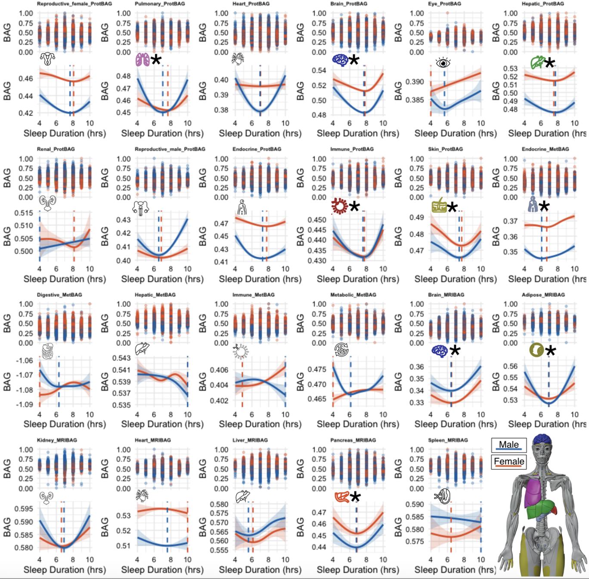

# SleepChart
This is the repository for sharing the R script for the GAM modeling between sleep duration and 23 biological aging clocks.

  

## Portals
**SleepChart**: All results and sleep GWAS summary statistics are publicly disseminated at our SleepChart portal: https://labs-laboratory.com/sleepchart/

**MEDICINE**: BAG GWAS summary statistics are publicly disseminated at our MEDICINE portal: https://labs-laboratory.com/medicine/

## Data
Because our primary analyses used UK Biobank data, we cannot publicly share any individual-level information, including sleep duration measures and the 23 biological aging clocks. Instead, we provide an analysis script that users can adapt by supplying their own approved UK Biobank CSV/TSV inputs. Data sources beyond the UK Biobank may be obtained through researcher application processes to respective studies (e.g., the NIA-supported BLSA) or are publicly available for download (e.g., FinnGen and PGC GWAS summary statistics). All relevant information is detailed in the **Data Availability** and **Code Availability** sections of the manuscript.

## Citing this work
> The MULTI Consortium et al., 2026. **Sleep chart of biological aging clocks in middle and late life**. ***<ins>Nature</ins>***, [Paper in PDF](https://www.nature.com/articles/s41586-026-10524-5)

> Wen, 2026. **Too little or too much sleep is linked with faster ageing throughout the body**. ***<ins>Nature Research Briefing (In Press)</ins>***, [Paper in PDF](#)

> Heidi Ledford, 2026. **Sleep linked to slower ageing: huge study pinpoints the right amount**. ***<ins>Nature News</ins>***, [Paper in PDF](https://www.nature.com/articles/d41586-026-01506-8)

## Related references for the 23 biological aging clocks
> The MULTI Consortium et al., 2025. **MRI-based multi-organ clocks for healthy aging and disease assessment**. ***<ins>Nature Medicine</ins>***, [doi:10.1038/s41591-025-03999-8](https://www.nature.com/articles/s41591-025-03999-8)

> Wen, 2025. **Refining the generation, interpretation and application of multi-organ, multi-omics biological aging clocks**. ***<ins>Nature Aging</ins>***, [doi:10.1038/s43587-025-00928-9](https://www.nature.com/articles/s43587-025-00928-9)

> The MULTI Consortium et al., 2025. **Multi-organ metabolome biological age implicates cardiometabolic conditions and mortality risk**. ***<ins>Nature Communications</ins>***, [doi:10.1038/s41467-025-59964-z](https://www.nature.com/articles/s41467-025-59964-z)
